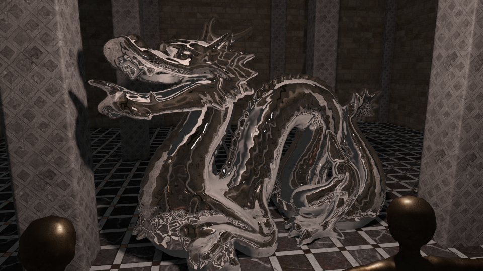

mTec - Efficient Rendering with Distance Fields
========================================
Master Thesis by Michael Mroz

This thesis gives an in-depth look into the most common distance field effects and presents a variety of acceleration techniques to show the viability of distance fields for modern game development.

Please refer to the [slides](talk_slides.pdf) from my talk at the University of Pennsylvania for an introduction into the topic of distance fields or my [thesis](SDF_Mroz.pdf) for more in-depth information.

LINK TO VIDEO HERE

Implementation
--------------
The entire code of the mTec renderer can be downloaded from this repo. Please note that Visual Studio and FreeGLUT/GLEW are required to compile an executable.
